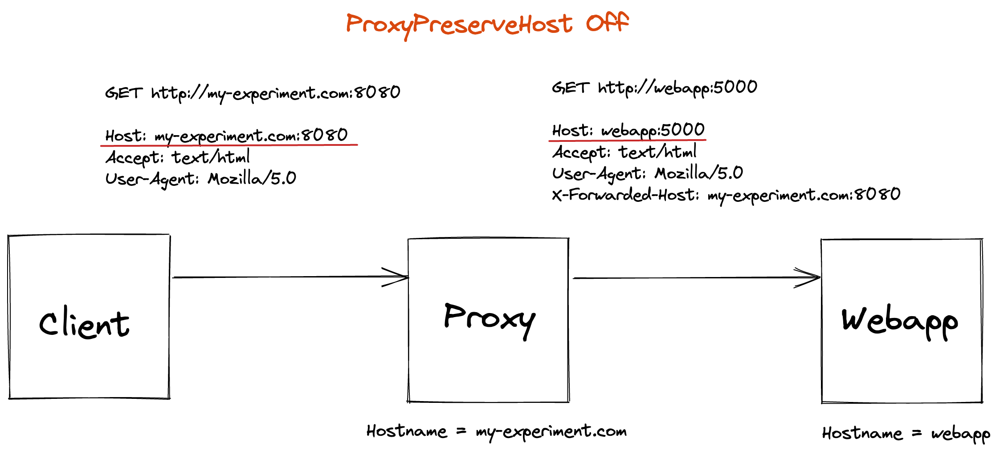
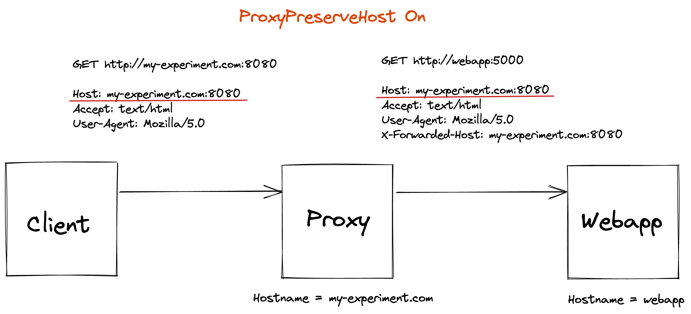
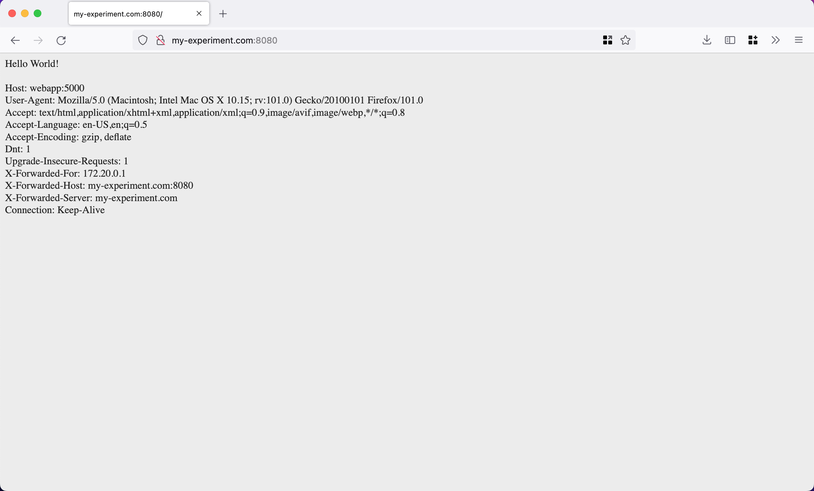
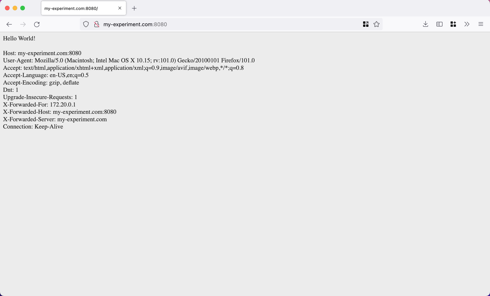

# ProxyPreserveHost

Sometimes, teams favor deploying [reverse proxies](https://www.nginx.com/resources/glossary/reverse-proxy-server/) in front of their application servers or even their kubernetes clusters.

In order for an application to support being reverse proxied, here are a few additional considerations [1]:

- support for context paths (e.g. "http://proxy.com/app1")
- awareness of hostname (either through config or HTTP-request header)

## The effect of ProxyPreserveHost

[`ProxyPreserveHost`](https://httpd.apache.org/docs/2.4/mod/mod_proxy.html#proxypreservehost) is an Apache httpd directive which passes the [`Host:`](https://developer.mozilla.org/en-US/docs/Web/HTTP/Headers/Host) line from the incoming HTTP request to the proxied host.

This is important because sometimes, apps use this `Host:` header to understand its hostname.
And this hostname may in turn be used in places such as (1) links to internal web resources, or (2) SAML SSO authentication.
Therefore an incorrect hostname could result in a broken application.

As shown above, the reverse proxy makes an HTTP `GET` requst on behalf of the client.
In this `GET` request, the HTTP header `Host: webapp:5000` is used.

When `ProxyPreserveHost On`, the same `Host:` HTTP header sent from the client is used (even though it does not match the hostname of the URL in the `GET` request).

## Running an experiment

To verify the above, we can run a quick experiment.
Running `docker-compose up --build` with [this code](https://github.com/thomasvn/ProxyPreserveHost) will start a Flask webapp and an Apache httpd reverse proxy.
The webapp simply prints out "Hello World!" and the contents of the HTTP `GET` Request to the browser.

When `ProxyPreserveHost Off`:

When `ProxyPreserveHost On`:

## Conclusion

Reverse proxies add an extra level of indirection, which slightly complicate the debugging of application issues.
Using the forbidden techniques of `print()` (as well as investigating logs) may add some observability into the proxy's operations and how it affects the app.

## Notes

[1] A simple reverse proxied app can function without these features.
However more complex reverse proxy + app deployments may run into issues.

<!-- 
TODO:

DONE:
- attach screenshot from experiment
- draw a diagram (sketch.io) to replace text explanation
- quick intro on reverse proxies (provide a link)
-->

<!--
REFERENCES:
- https://podrezo.medium.com/using-a-reverse-proxy-with-your-web-application-5eec92001193
-->